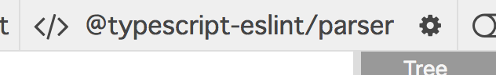

# 其他解析器

你的团队可能会使用一些转译器（如 TypeScript）来编写项目源代码。
在这种情况下，你创建的 ESLint 规则应该使用相同的转译器进行测试。

## 添加其他解析器

通过本章，我们将能够处理 TypeScript / React JSX。

```tsx
type Props = {
  onClick: () => void;
};
const MyComponent = ({ onClick }: Props) => <button onClick={() => onClick()} />;
```

假设我们想要禁止使用 `<button />` React 组件。

首先，让我们了解这段代码的 AST 结构。
还记得吗？
没错，我们可以使用 https://astexplorer.net

要启用 TypeScript/JSX 解析，将解析器类型切换到 "@typescript-eslint/parser"。



提示：ESLint 默认使用 espree 作为解析器。

你能找到查询 `<button />` 的方法吗？
是的，就是 `JSXIdentifier[name='button']`。

所以我们的规则实现如下：

```ts
/* src/rules/no-jsx-button.ts */

import { Rule } from "eslint";
import { Node } from "estree";

const rule: Rule.RuleModule = {
  create: context => {
    return {
      "JSXIdentifier[name='button']": (node: Node) => {
        context.report({
          message: "不要使用 <button>",
          node,
        });
      },
    };
  },
};

export = rule;
```

## 配置规则测试器

接下来，我们需要测试上述规则，所以要为我们的项目添加解析器。

```sh
$ npm i @typescript-eslint/parser --dev
```

然后将解析器配置告诉 ESLint RuleTester。

```ts
/* src/rules/no-jsx-button.test.ts */

import { RuleTester } from "eslint";

import rule from "./no-jsx-button";

// 指定解析器
const tester = new RuleTester({
  parser: require.resolve("@typescript-eslint/parser"),
  parserOptions: {
    ecmaFeatures: {
      jsx: true,
    },
  },
});

tester.run("no-jsx-button", rule, {
  valid: [
    {
      code: `(props: Props) => <div />`,
    },
  ],
  invalid: [
    {
      code: `(props: Props) => <button />`,
      errors: [{ message: "不要使用 <button>" }],
    },
  ],
});
```

`parserOptions` 接受的值由每个解析器定义。
例如，`@typescript-eslint/parser` 的可配置值列在 [@typescript-eslint/parser configuration](https://github.com/typescript-eslint/typescript-eslint/tree/master/packages/parser#configuration) 中。`parser` / `parserOptions` 值也应该存在于你团队项目的 `.eslintrc` 中。

如果你忘记配置 RuleTester 的解析器，`npm test` 会输出解析错误，如：

```text
Message:
  Should have no errors but had 1: [ { ruleId: null,
    fatal: true,
    severity: 2,
    message: "Parsing error: '>' expected.",
    line: 1,
    column: 23 } ]
```

## 总结

- 使用与项目相同的解析器来测试规则

[上一章](../20_dive_into_ast/README.md)
