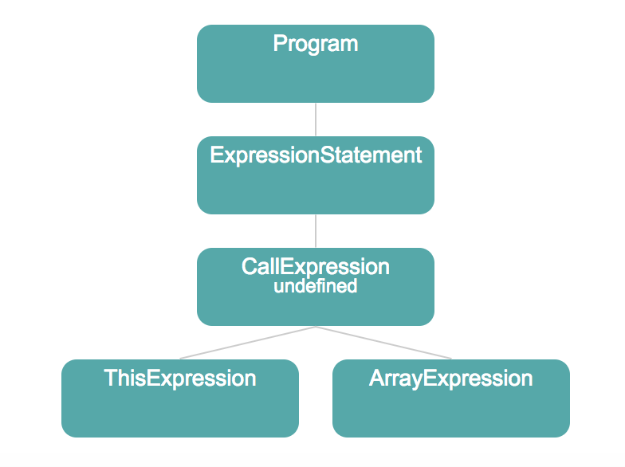
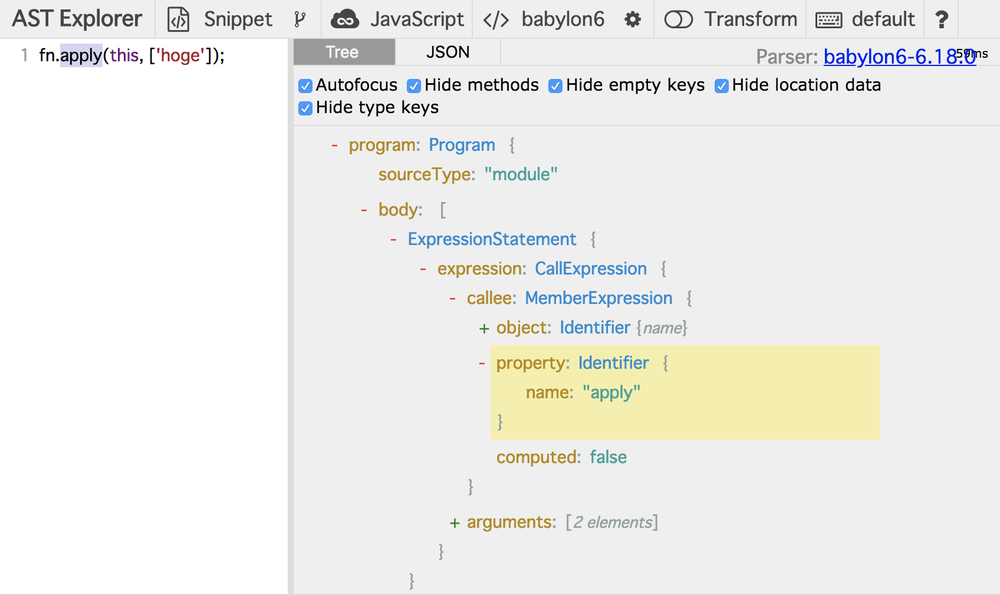
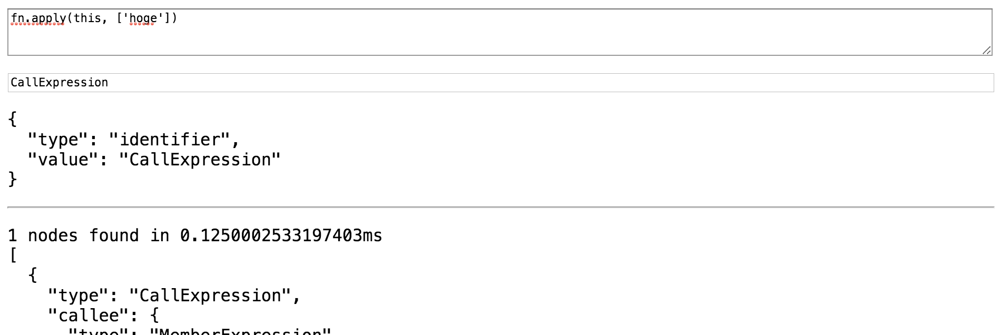

# 深入 AST

我们已经学习了如何编写 ESLint 规则模块。
在本章中，让我们学习 ESLint 规则和 AST（抽象语法树）分析之间的关系。
换句话说，我们将学习如何从源代码中找到你想要禁止的部分！

## 主题

本章的目标是创建一个规则，用于查找调用函数 `apply` 方法的代码部分。
例如：

```js
const fn = x => console.log(x);
fn.apply(this, ["hoge"]); // 我们想要禁止这个！
```

现在，让我们采用 TDD 方法。

First, we write a test for this rule.
Put a new test file as `src/rules/no-function-apply.test.ts` and edit the following:

```ts
import { RuleTester } from "eslint";

import rule from "./no-function-apply";

const tester = new RuleTester({ parserOptions: { ecmaVersion: 2015 } });

tester.run("no-function-apply", rule, {
  valid: [{ code: `fn('hoge')` }],
  invalid: [
    {
      code: `fn.apply(this, ['hoge'])`,
      errors: [{ message: "不要使用 'apply'" }],
    },
  ],
});
```

And create a rule module corresponding it.

```ts
/* src/rules/no-function-apply.ts */

import { Rule } from "eslint";

const rule: Rule.RuleModule = {
  create: context => {
    return {
      // 稍后实现
    };
  },
};

export = rule;
```

上面的规则还是空的，当给定无效的源代码时不会报错，所以 `npm test` 必定会失败。

## 可视化 AST

在编写规则之前，先思考一下我们想要查找和禁止的源代码模式。

在 ESLint 世界中，JavaScript 程序源代码被识别为 AST。
因此，"源代码的模式"可以改写为"AST 的模式"。

让我们来解析 `fn.apply(this, ['hoge'])` 的 AST 形状，这是规则要禁止的无效代码示例。

下图是对应的 AST 可视化：



AST 是树形结构的数据表示。
你可以使用 https://astexplorer.net 查看和检查你的源代码的 AST。



https://astexplorer.net/#/gist/76acd406762b142f796a290efaba423e/f721eb98505736ec48892ab556517e30d2a24066

## ESLint 的 AST

ESLint 中的解析器（如 acorn、esprima、babylon、typescript-eslint-parser 等）将 JavaScript 源程序解析为语法树，这个树的每个元素被称为"节点"。
节点定义为以下接口：

```ts
interface BaseNodeWithoutComments {
  // 每个继承 BaseNode 的叶子接口都必须指定一个 type 属性。
  // type 属性应该是一个字符串字面量。例如，Identifier
  // 有：`type: "Identifier"`
  type: string;
  loc?: SourceLocation | null;
  range?: [number, number];
}
```

如上所述，我们通过 AST explorer 获得了 `fn.apply(this, ['hoge'])` 的 AST 对象，发现这个树有一个 "ExpressionStatement" 对象。
这个对象也是一种节点类型。
而且节点的 `type` 是字符串值 `"ExpressionStatement"`。

好，让我们回到 ESLint 的规则。

在上一章中，我们编写了一个简单的规则，如：

```ts
const rule: Rule.RuleModule = {
  create: context => {
    return {
      Literal: node => {
        // 做一些事情
      },
    };
  },
};
```

`create` 函数返回一个对象，其键名为 `Literal`。
这个键名 "Literal" 是从哪里来的？
它是字面量 AST 节点的类型名称，ESLint 根据这个名称调用处理函数。

我们可以在对象中使用更复杂的键，称为"选择器"。
选择器与 HTML 中的 CSS 查询非常相似。

例如，以下是在函数调用表达式中查找字面量节点的选择器：

```text
"CallExpression Literal"
```

这是一个后代查询的例子。
选择器表示法几乎与 CSS 查询表示法相同。
如果你想了解其他查询语法，请参见 https://github.com/estools/esquery。

## 构建选择器

让我们构建一个选择器查询来查找调用 apply 函数的代码，如 `fn.apply(this, ['hoge'])`。

esquery 演示应用对此非常有用。

- 打开 http://estools.github.io/esquery/
- 在顶部文本区域输入 `fn.apply(this, ['hoge'])`
- 在下一个文本输入框中输入 `CallExpression`



这个工具告诉我们输入的查询是否命中输入源代码的 AST。

现在我们想要查找调用 `.apply`，这可以分解为以下几点：

- CallExpression 节点
- MemberExpression 节点
- 名称为 "apply" 的 Identifier 节点

通过 AST explorer 的结果，我们已经知道了 `fn.apply(this, ['hoge'])` 的 AST 结构。
思考一下哪个查询能匹配它们。

你找到答案了吗？
以下查询将会命中：

```
CallExpression > MemberExpression > Identifier.property[name='apply']
```

让我们完成我们的 "no-function-apply" 规则：

```ts
/* src/rules/no-function-apply.ts */

import { Rule } from "eslint";
import { Node } from "estree";

const rule: Rule.RuleModule = {
  create: context => {
    return {
      "CallExpression > MemberExpression > Identifier.property[name='apply']": (node: Node) => {
        context.report({
          message: "不要使用 'apply'",
          node,
        });
      },
    };
  },
};

export = rule;
```

最后，再次运行 `npm test`。它应该成功通过了 :sunglasses:

## 附录：esquery 的 "field" 语法

你注意到我们使用 `Identifier.property[name='apply']` 而不是 `Identifier[name='apply']` 了吗？
`.property` 部分在 esquery 语法中被称为 "field"。
`Identifier.property` 表示"在父节点中作为 `property` 字段的 Identifier 节点"。

为什么我们要使用这种语法？
`Identifier[name='apply']` 不能满足我们的规则吗？

确实不能。

`fn.apply` 被解析为一个 MemberExpression 节点，这个节点有两个子节点，它们都具有相同的类型 "Identifier"。

```js
{
  type: "MemberExpression",
  object: {
    type: "Identifier",
    name: "fn"
  },
  property: {
    type: "Identifier",
    name: "apply"
  }
}
```

所以如果我们使用 `Identifier[name='apply']`，我们的规则会对有效代码 `apply.hoge()` 报错。

我们可以使用 `Identifier.property` 选择器只选择第二个 Identifier 节点。

## 总结

- 我们可以在 ESLint 规则中使用 AST 选择器作为对象的键
- 我们可以通过 https://astexplorer.net 检查 AST
- 我们可以通过 http://estools.github.io/esquery 检查选择器查询

[上一章](../你的第一个规则/README.md)
[下一章](../其他解析器/README.md)
